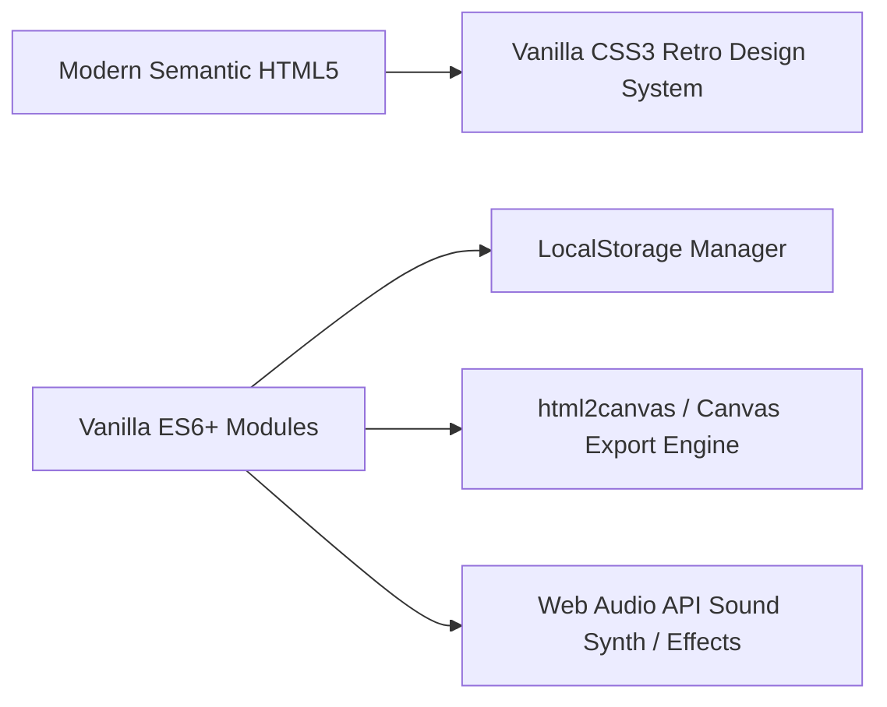

# Product Requirements Document (PRD)
## Project: Dopamine Menu (Mobile Web App)
**Version:** 1.0.0  
**Target Platform:** Mobile-First Web Application (PWA-Ready, Responsive Desktop Support)  
**Theme:** Retro Y2K Pink Windows 95/98/XP Aesthetics ("Clueless" / Barbie / Cyber-Desktop)  
**Design Constraint:** Strictly NO emojis anywhere in the UI or copy (use retro pixel icons, custom sticker graphics, ASCII symbols like `<3`, `*`, `[+]`, and vintage Windows typography instead).

---

## 1. Executive Summary & Vision

### 1.1 Concept
The **Dopamine Menu** is an interactive, tactile self-care web application designed to help neurodivergent individuals, students, professionals, and anyone experiencing low energy or executive dysfunction easily discover and choose joy-inducing activities.

Taking inspiration from the restaurant menu framework for dopamine management, activities are split into digestible courses: **Appetizers**, **Sides**, **Entrees**, **Desserts**, and **Specials**.

### 1.2 Aesthetic Direction
The app is heavily stylized around **Y2K Retro Pink Windows OS** aesthetics:
- Beveled window chrome, retro gradient title bars with pixel `_ [] X` window action buttons.
- Nostalgic retro toolbar menus (`File`, `Edit`, `View`, `Favorites`, `Help`).
- Bubblegum pinks, lavender gradients, glitter textures, pixel badges, and user-provided sticker decorations.
- Pure retro UI graphics: Zero standard emojis; all visual cues use retro pixel art, SVGs, vintage ASCII emoticons (e.g. `(^.^)`, `<3`, `(o.o)`), or authentic Windows icons.
- Interactive sound effects (retro mouse clicks, popup chimes, success jingles).
- High-fidelity **Social Shareable Menu Card** (designed for Instagram Stories, TikTok, Pinterest).

---

## 2. Target Audience & Problem Statement

| Metric | Details |
| :--- | :--- |
| **Primary Audience** | Gen Z & Millennial mobile users, ADHD/neurodivergent community, wellness & aesthetic enthusiasts. |
| **Core Problem** | When dopamine is low or executive dysfunction strikes, brainstorming feel-good activities is overwhelming. Standard task managers feel like chores rather than uplifting tools. |
| **Solution** | A tactile, playful, and visually delightful "order-up" menu that reduces decision fatigue and turns self-care into a cute retro desktop game. |

---

## 3. Core Features & Functional Requirements

### 3.1 Interactive Tabbed Workflow & Windows OS Architecture
The application features a sleek tabbed interface where users switch between categories as tabs, each opening into a dedicated retro Windows OS page.

```mermaid
graph TD
    Header[App Header & Progress Bar] --> Tabs[Category Tab Bar: Appetizers | Sides | Main | Desserts | Specials]
    Tabs --> Page[Active Retro Category Window]
    Page --> Sticker[Category Sticker Illustration]
    Page --> Suggestions[Interactive Suggestion Pills: Select up to 3]
    Page --> AddCustom[Add Your Own Activity Input]
    Page --> Actions[Global Shuffle & See My Menu Buttons]
    Actions --> Dashboard[Compiled 2-1-2 Dopamine Menu Modal]
```

#### A. Main Screen Header & Progress Bar
- **App Title:**
  - Header: `"My Dopamine Menu"` (or `"Dopamine Menu"`)
- **Progress Indicator:**
  - Dynamic status text: `X of 5 categories filled`
  - Retro beveled progress bar filling up as the user makes selections in each category.
- **Retro Category Tab Bar:**
  - 5 switchable tabs: `APPETIZERS`, `SIDES`, `MAIN`, `DESSERT`, `SPECIALS`.
  - Active tab is highlighted with a vintage beveled/raised button style.

#### B. Active Category Window Page
When a user selects a tab, the retro Windows OS frame renders:
1. **Category Sticker Hero:** Centered high-res sticker asset (Black Pug, Fawn Pug, Frog in Sweater, etc.).
2. **Category Header & Subtitle:**
   - **APPETIZERS:** Subtitle `LESS THAN 5 MINS`
   - **SIDES:** Subtitle `ADD TO BORING TASKS`
   - **MAIN:** Subtitle `ENERGIZING ACTIVITIES`
   - **DESSERT:** Subtitle `ENJOY IN MODERATION` (or `ENJOY SPARINGLY`)
   - **SPECIALS:** Subtitle `OCCASIONAL SPLURGES`
3. **Helper Note:** `"Tip: Keep it to 3 choices to avoid overwhelm"`.
4. **"CHOOSE FROM SUGGESTIONS" Section:**
   - Responsive grid of vintage button/pill suggestions.
   - Tapping an item toggles its selection (up to 3 max per category).
   - Selected items display a distinct highlighted pink/beveled active state.
5. **"ADD YOUR OWN" Section:**
   - Text input (`"Type an activity..."`) with a retro `[+]` button.
   - Added activities immediately appear as selectable pills with a delete option (`[x]`).
6. **Global Actions:**
   - **"[Shuffle Menu]"**: Rolls a complete random 5-category dopamine menu.
   - **"[See my menu ->]"**: Sticky bottom button that opens the compiled social-ready Dopamine Menu dashboard.

---

### 3.2 Category Content & Default Suggestion Library

1. **Appetizers** (*Subtitle: "LESS THAN 5 MINS"*)
   - Take 5 deep breaths
   - Stretch for 2 minutes
   - Make your favorite drink
   - Step outside for fresh air
   - Doodle something random
   - Write three things you're grateful for
   - Water your plants
   - Look out the window
   - Pet your pet
   - Do a quick tidy
   - Hum your favorite song
   - Drink a full glass of water

2. **Sides** (*Subtitle: "ADD TO BORING TASKS"*)
   - Put on a playlist
   - Light a scented candle
   - Make a snack first
   - Work in a cozy spot
   - Wear comfy clothes
   - Ambient sounds on
   - Use your nicest mug
   - Prep a reward afterward
   - Work near a window
   - Open the window
   - Put on a podcast
   - Set a fun timer

3. **Main** (*Subtitle: "ENERGIZING ACTIVITIES"*)
   - Go for a walk
   - Cook a proper meal
   - Call a friend
   - Read a chapter
   - Exercise
   - Create something
   - Journal
   - Take a long shower
   - Visit somewhere new
   - Meditate
   - Dance to a full song
   - Spend time in nature

4. **Dessert** (*Subtitle: "ENJOY IN MODERATION / ENJOY SPARINGLY"*)
   - Scroll social media
   - Watch YouTube
   - Binge a show
   - Buy something I've been wanting
   - Play mobile games
   - Browse TikTok
   - Eat comfort food
   - Watch movie clips
   - Browse Reddit
   - Read celebrity news

5. **Specials** (*Subtitle: "OCCASIONAL SPLURGES"*)
   - Plan a trip
   - Go to a concert
   - Try a new restaurant
   - Spa day
   - Buy something wanted
   - See live theater
   - Go to a festival
   - Take a class
   - Weekend getaway
   - Visit a museum
   - Attend a local event
   - Watch sports live

#### B. The Global "Shuffle / Surprise Me" Engine
- **Single Overall Shuffle Button:** A prominent **"[Shuffle Menu]"** or **"[Surprise Me]"** button located on the main action bar / desktop toolbar.
- **Randomized Menu Compilation:** With one tap, it automatically draws a completely randomized, balanced Dopamine Menu (selecting up to 3 random activities across each of the 5 categories from both preloaded suggestions and custom user entries).
- **Executive Dysfunction Buster:** Designed specifically for moments of overwhelm when the user doesn't want to think—instantly populating a ready-to-go feel-good agenda.
- **Retro Animation & Feedback:** Features a vintage slot-machine roll / sparkle burst effect and retro sound effect when pressed.

#### C. Custom Sticker & Theme Support
- Each window header features an iconic sticker avatar slot displaying user-provided graphic stickers.
- Wallpaper switcher allowing user to toggle between `background option 1`, `background option 2`, and `background option 3`.

#### D. "See My Menu" (Social Share & Compiled Menu Dashboard)
- Sticky bottom action bar with a prominent **"[See My Menu]"** button.
- Opens an overlay / printable view rendering the exact **Compiled Dopamine Menu Card** (matching the mockup design):
  - **Header:** Retro pixelated typography centered at top: `"Dopamine Menu"`.
  - **Background Canvas:** Iridescent pastel pink holographic backdrop with soft star sparkles.
  - **Window Grid Layout (2-1-2 Format):**
    - **Top Row (2 Columns):** `Appetizers` (left) and `Sides` (right).
    - **Middle Row (1 Centered Wide Column):** `Main` / `Energizing Activities` (prominently featured).
    - **Bottom Row (2 Columns):** `Desserts` (left) and `Specials` (right).
  - **Individual Window Card Structure:**
    - **Title Bar:** Solid pink retro header with crisp black category title (`Appetizers`, `Sides`, `Main`, `Desserts`, `Specials`).
    - **Subtitle Banner:** Secondary banner bar specifying course duration/intent:
      - Appetizers: `"Less than 5 min"`
      - Sides: `"Add to boring tasks"`
      - Main: `"Energizing Activities"`
      - Desserts: `"Enjoy in moderation"`
      - Specials: `"Occasional splurges"`
    - **Inner Content Box:** Framed with classic Windows 95/98 gray horizontal and vertical scrollbars (complete with scroll arrows and slider track).
    - **Card Interior:**
      - **Left:** Cute sticker / avatar graphic cutout (e.g., pug, frog plushie, or user-chosen sticker).
      - **Right:** Clean pixel bulleted list (`. Activity 1`, `. Activity 2`, `. Activity 3`) displaying the user's selected 3 picks.
  - **Export & Share Features:**
    - **Download Image (PNG):** High-resolution export formatted for Instagram Stories / TikTok (9:16) and Square (1:1).
    - **Copy Checklist:** Formatted text copy for notes or messaging.
    - **Edit / Re-select:** Easily jump back into interactive selection mode.

#### E. State Management & Offline Storage
- All selected items, custom added activities, and active theme preferences are persisted in browser `localStorage`.
- Zero backend required for v1; 100% private, instant loading, and fully functional offline.

---

## 4. UI / UX Design & Component Architecture

### 4.1 Strict Design Constraint: NO EMOJIS
- **Zero Unicode Emojis:** Standard OS emojis (like smiles, animals, food emojis) are strictly forbidden across the entire application.
- **Retro Alternative Design Assets:**
  - Pixel art icons & vintage Windows system glyphs.
  - Classic ASCII emoticons (e.g., `<3`, `(o.o)`, `*.*`, `(^_^)`, `~*~`).
  - High-res sticker graphics provided by the user.
  - Authentic retro typography and 3D beveled buttons.

### 4.2 Design Tokens & Y2K Aesthetic Guide

```css
/* Color Palette */
--pink-primary: #FF69B4;
--pink-deep: #FF1493;
--pink-hot: #FF007F;
--pink-bubblegum: #FFB6C1;
--pink-light: #FFE4E1;
--pink-lavender: #F8E8FF;
--pink-window-bar: linear-gradient(90deg, #FF66B2 0%, #FF99CC 100%);

/* Retro Windows Chrome */
--win-bevel-light: #FFFFFF;
--win-bevel-dark: #C47291;
--win-bg: #FFF0F5;
--win-border: 2px solid #FF69B4;
--win-shadow: 3px 3px 0px #C47291;

/* Typography */
--font-retro-title: "MS Sans Serif", "VT323", "Press Start 2P", monospace;
--font-body: "W95FA", "Segoe UI", -apple-system, sans-serif;
--font-fancy: "Comic Sans MS", "Chalkboard SE", "Outfit", cursive, sans-serif;
```

### 4.3 Mobile-First Viewport Strategies
1. **Swipeable Windows / Tabs Stack:**
   - On mobile screens, provide a retro taskbar allowing users to switch between category tabs (Appetizers, Sides, Entrees, Desserts, Specials) or scroll vertically through stacked minimizable retro windows.
2. **Desktop View:**
   - Free-floating draggable windows scattered across the screen imitating a vintage Windows desktop with selectable wallpaper background.

---

## 5. Technical Architecture & Tech Stack



### 5.1 Tech Stack Justification
- **Frontend Core:** Pure HTML5, Vanilla Modern CSS3 (Grid/Flexbox + 3D Bevel CSS filters), and Modern ES6+ JavaScript.
- **Export Engine:** `html2canvas` or Native Canvas API for crystal-clear 2x retina social card generation.
- **Icons & Stickers:** Scalable pixel icons, SVG stickers, and user-provided image assets.
- **Storage:** HTML5 `localStorage` with JSON schema validation.

---

## 6. Non-Functional Requirements

1. **Performance:** Lighthouse Performance score >= 95 on mobile 4G. First Contentful Paint < 1.0s.
2. **Accessibility:** Contrast-checked text options, keyboard navigation support for checkboxes, screen-reader friendly labels.
3. **Responsiveness:** Flawless layout scaling from 320px (iPhone SE) up to 4K desktop screens.
4. **Data Privacy:** 100% client-side storage; no personal data sent to any third-party servers.

---

## 7. Delivery Milestones & Phased Roadmap

| Phase | Milestone | Deliverables |
| :--- | :--- | :--- |
| **Phase 1** | **Core UI & Windows Engine** | Retro Windows 95/Y2K CSS theme, 5 category windows, sticker slots, custom backgrounds (Strictly no emojis). |
| **Phase 2** | **Interaction & Storage** | 3-item selection rules, custom item additions, local storage persistence, overall global menu shuffle. |
| **Phase 3** | **Social Share Generator** | "See My Menu" modal, high-res canvas social graphic exporter (9:16 IG Story format & square receipt). |
| **Phase 4** | **Retro SFX & Polish** | Click sound effects, sparkle animations, haptic touch feedback, PWA offline install manifest. |

---

## 8. Appendix: Provided Assets Integration
The application utilizes the following user-provided assets:
- **Wallpapers / Background Options:**
  - `background option 1.jpeg` (Floral Pink Y2K Wallpaper)
  - `background option 2.jpeg` (Soft Pink Sparkle Pattern)
  - `background option 3.jpeg` (Retro Floral Y2K Pattern)
- **Category Sticker Assets:**
  - **Appetizers:** Black Pug Cutout Sticker
  - **Sides:** Fawn Pug Standing Cutout Sticker
  - **Main (Energizing Activities):** Green Frog Plushie in Sweater Cutout Sticker
  - **Desserts:** Fawn Pug Looking Up Cutout Sticker
  - **Specials:** Green Frog Plushie in Party Hat Cutout Sticker
- **Design References:**
  - `dopamine menu inspiration.jpg` (Visual Theme Reference Guide)
  - `Dopamine Menu Mockup.png` (Compiled Menu Layout Reference)

*Prepared for Makaela Harrell's Dopamine Menu Web App.*
